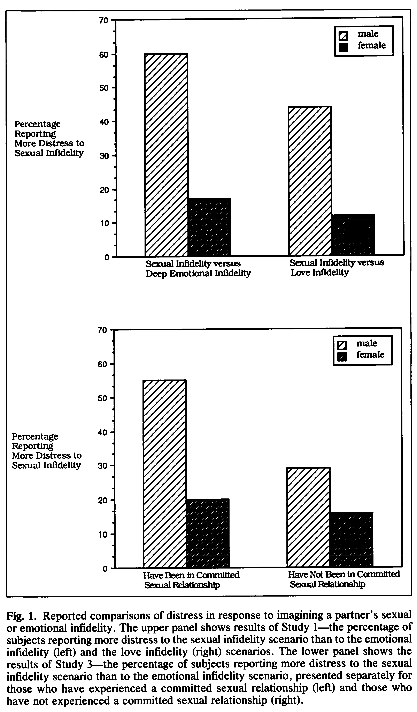
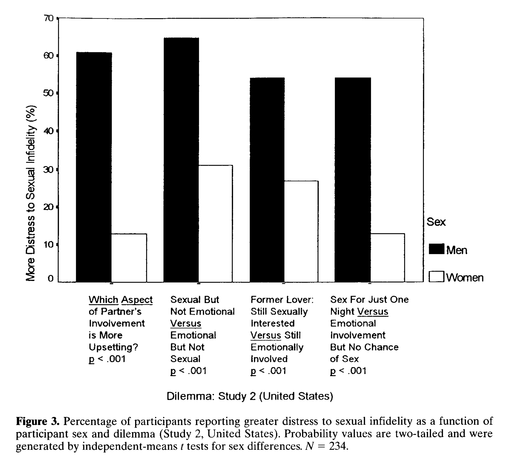
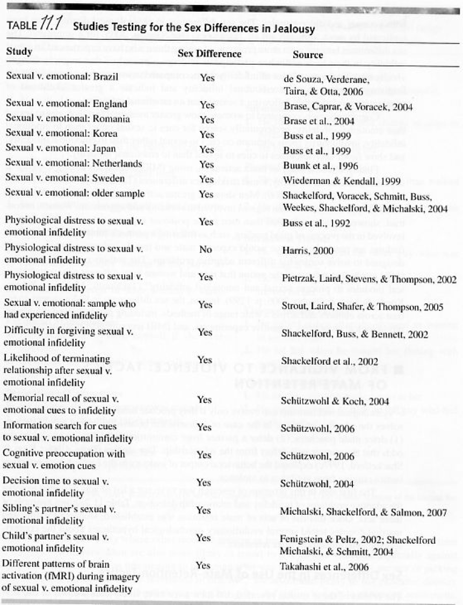
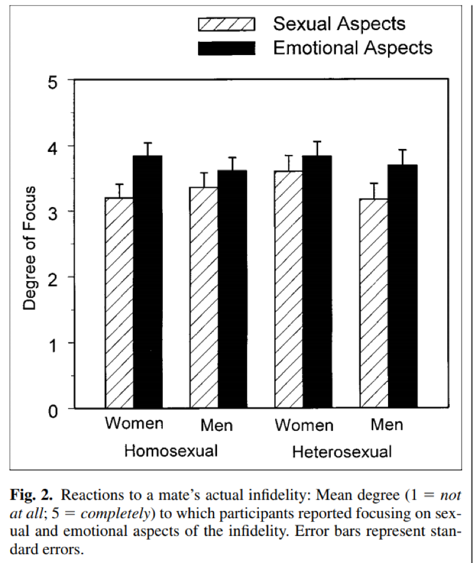
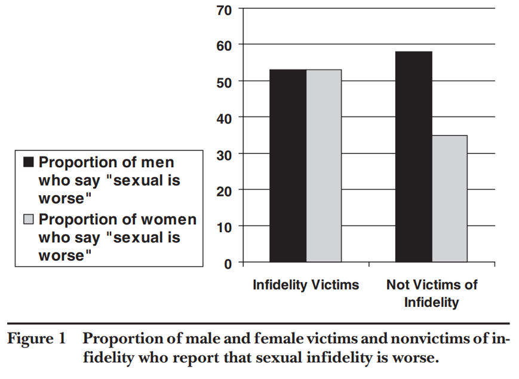
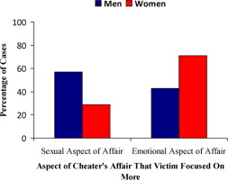
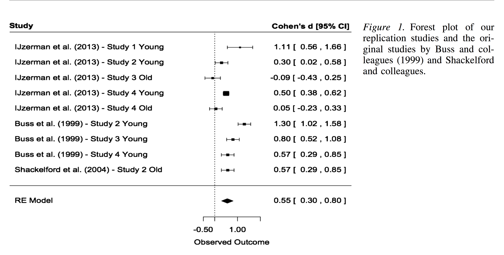
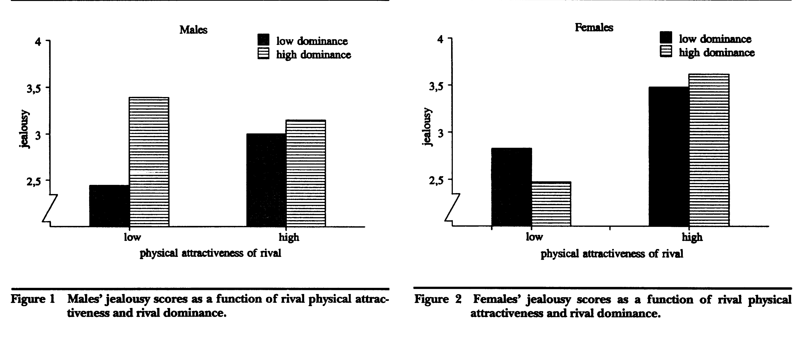

```{r setup, include=FALSE}
options(htmltools.dir.version = FALSE)
knitr::opts_chunk$set(echo = TRUE)
```


```{r, load_refs, echo=FALSE, cache=FALSE, warning=F, results='hide', message=F}
library(RefManageR)
BibOptions(check.entries = FALSE,
           bib.style = "authoryear",
           cite.style = 'alphabetic',
           hyperlink = FALSE,
           dashed = FALSE,
           style = "html")
myBib <- ReadBib("./myBib.bib", check = FALSE)
```


```{r, png, echo=FALSE, cache=FALSE, warning=F, results='hide', message=F}
require(png)
```


## Outline of today.

* Intro.

* Discussing a classic study on 'Jealousy'.

* Formulating a research question.

* Summary.

We'll use '[zeetings](www.zeetings.com/tvpollet)' to make it a bit more interactive. Go to [www.zeetings.com/tvpollet](www.zeetings.com/tvpollet) for the interactive bit.

--> Goal for today: give you some insight into a classic study, criticism and ongoing studies.

```{r, out.width = "250px", echo=FALSE, fig.align='center'}
knitr::include_graphics("https://media.giphy.com/media/RHLcOWQ4xqyOKvqzAc/giphy.gif")
```

???
No need to take extensive notes. References at end of slides.

---
## Jealousy and intimate relationships.

* This topic could be sensitive to some of you. However, you'll have come across news stories relating to jealousy.

* Should you feel uncomfortable, then please refrain from taking part in the activities and feel free to leave. (If you need to discuss any issues you can approach Ask4Help, the students union or [Samaritans](www.samaritans.org)).

```{r, out.width = "350px", echo=FALSE, fig.align='center'}
knitr::include_graphics("https://secure.i.telegraph.co.uk/multimedia/archive/01716/bruni_1716788c.jpg") # image from AFP/reuters used under fair use
```

---
## Who am I... ?

* I teach the option course Research on Human Nature and [Advanced Quantitative methods](https://tvpollet.github.io/PY0794). Also, I am the _'Director of Learning & Teaching: Experience'_.

--

* I am an interdisciplinary behavioural scientist and I have published [too many papers](https://tvpollet.github.io/papers). I work mostly on social relationships (friendships, loneliness, social networks, attraction in romantic relationships), but have ventured out (e.g., research methodology, sex ratios, left-handedness, body image (height), personality, PTSD, 'cyberpsychology',...). One of the topics I have worked on is jealousy --> Hence this lecture.

---
## Let's do a survey!

Please navigate your laptop, Ipad/tablet or phone to: https://nupsych.qualtrics.com/jfe/form/SV_9FVnjeYDkTJIkTP

Later on it will become clear what the purpose is!

---
## Evolutionary psychology

**zeetings question on EP**

**zeetings question on jealousy**

---
## Jealousy and evolutionary psychology.

Here, is the argument:

--

* Jealousy is an evolved behaviour to motivate us to protect our close relationships from interference.

--

* Throughout evolutionary history, those who responded with jealousy were more likely to maintain their relationships and would be more likely to reproduce.

--> does this seem plausible? **zeetings question**

```{r, out.width = "350px", echo=FALSE, fig.align='center'}
knitr::include_graphics("https://media.giphy.com/media/7ErVXMJYavwWc/giphy.gif")
```

???
If so, then presumably we have adaptations to deal with detecting and responding to jealousy.

---
## Jealousy

* People typically are upset by a partner’s actual or perceived infidelity.

--

* Infidelity: sexual, falling in love, become too close to someone else, spending too much time with someone else…

--

Sex differences in contributions to reproduction in a heterosexual relationship:

Women: pregnancy, nursing, etc.

Men: resources

(Trivers, 1972)

```{r, out.width = "300px", echo=FALSE, fig.align='center'}
knitr::include_graphics("https://media.giphy.com/media/26uf0lb7pXOANdre8/giphy.gif")
```


---
## Infidelity

According to evolutionary psychologists: In what way can infidelity curtail these contributions?

--

Women’s pregnancy, nursing contribution: Men most threatened by woman’s sexual infidelity (risk of pregnancy by another man)

--

Men’s resource contribution: Women most threatened by men’s emotional infidelity (could divert resources to another woman)

```{r, out.width = "300px", echo=FALSE, fig.align='center'}
knitr::include_graphics("https://media.giphy.com/media/lQ0zDXnZJwfcQLtNUP/giphy.gif")
```

---
## Classic study (Buss et al., 1992).

[This paper](https://pdfs.semanticscholar.org/a29f/af2933afbd921c0b4b1de62e01a967a2307c.pdf) has over 1,650 citations in Google scholar.

--

Thrre studies on sex differences in jealousy (2 studies based on surveys and one based on a physiological measure (EMG))

**zeetings question**

```{r, out.width = "300px", echo=FALSE, fig.align='center'}
knitr::include_graphics("https://media.giphy.com/media/ATt7p8OO4mvvO/giphy.gif")
```


???
Electromyography.

---
## Graphical summary

```{r, out.width = "300px", echo=FALSE, fig.align='center'}

```

---
## Conclusion.

_"All studies showed large sex differences, confirming hypothesized sex linkages in jealousy activation."_

```{r, out.width = "300px", echo=FALSE, fig.align='center'}
knitr::include_graphics("https://media.giphy.com/media/sRMPFaVQLGSw8/giphy.gif")
```


???
Key study for evolutionary psychology. “We also replicated this gender difference with a differently worded infidelity dilemma—a partner trying different sexual positions with a rival versus falling in love with a rival. Across both dilemmas, contrasting a sexual with an emotional infidelity using the forced-choice paradigm always produced a replicable gender difference.” (from Buss 2018 review).

---
## Criticisms?

**zeetings question**

Don't click ahead just yet... .

```{r, out.width = "350px", echo=FALSE, fig.align='center'}
knitr::include_graphics("https://media.giphy.com/media/tZpGRRMUoXgeQ/giphy.gif")
```

---
## Criticism: Assumptions about sexual behaviour.

What about assumptions about men’s and women’s sexual behaviour?

--

_"Among men, sex sometimes results in intimacy; among women, intimacy sometimes results in sex.”_ Symons (1979)

**Men**: sex less significant. Love probably entails sex (not vice versa).

**Women**: sex more significant. Sex probably entails love (not vice versa).

Thus, asymmetric differences in whether one type of infidelity entails the other (DeSteno & Salovey, 1996).

---
## Response to criticism.

Buss et al. (1999) looked among other things at different phrasings

```{r, out.width = "400px", echo=FALSE, fig.align='center'}

```

---
## Replications...

* Gender differences replicated in different cultures, and using different methods (see Buss 2018)

* China, Korea, Japan, Chile, Spain, Romania, Ireland, Sweden, Norway

* Range of methods: Physiological methods (EEG, fMRI); behavioural measures; verbal interrogations; visual attention (eye tracking); etc.

**zeetings question**

```{r, out.width = "350px", echo=FALSE, fig.align='center'}
knitr::include_graphics("https://media.giphy.com/media/nctC3W3nNRjqw/giphy.gif")
```

???
Gender differences replicated in different cultures, and using different methods (see Buss 2018)
China, Korea, Japan, Chile, Spain, Romania, Ireland, Sweden, Norway
Physiological methods (EEG, fMRI); behavioural measures; verbal interrogations; attention; etc.
Electroencephalogram (32 in scrabble) - functional magnetic resonance imaging


---
## Summary


```{r, out.width = "400px", echo=FALSE, fig.align='center'}

```

---
## Criticism: Actual vs. Imagined fidelity.

Difficult to imagine infidelity in an abstract form.

--

Harris (2002) used a sample of people whe experienced infidelity (N=150).

--

```{r, out.width = "375px", echo=FALSE, fig.align='center'}

```

???
But criticized for using 'focus' rather than jealousy.

---
## Criticism: Actual vs. Imagined fidelity.

Berman and Frazier (2005) also failed to find support for the hypothesised sex difference in actual infidelity (but N=64 in that contrast).

--

```{r, out.width = "450px", echo=FALSE, fig.align='center'}

```

---
## Other studies on actual infidelity.

But: Other studies present mixed results.

--

Edlund et al. (2006): two studies: students (N=206) and non-students (N=125) find support.

--

Varga et al. (2011): sample of students (N=294) and non-students (N=325) find no support.

--

Zengl et al. (2013): nationally representative sample (N>1600, of which 785 had experienced infidelity) find support

```{r, out.width = "275px", echo=FALSE, fig.align='center'}
knitr::include_graphics("https://media.giphy.com/media/xT0xeuOy2Fcl9vDGiA/giphy.gif")
```

???
Reported overall sample sizes. Mostly around 50% that experienced infidelity.

---
## What's the issue with asking about actual infidelity?

**zeetings question**

```{r, out.width = "400px", echo=FALSE, fig.align='center'}
knitr::include_graphics("https://media.giphy.com/media/5xtDarHCvP0RwW0WZvq/giphy.gif")
```


---
## Criticism: Accuracy of recall?

Kuhle (2011) analysed 51 episodes of 'Cheaters' using 6 coders ( $\chi^2$ test, _p_=.016).

```{r, out.width = "400px", echo=FALSE, fig.align='center'}

```

---
## Example clip.

<iframe width="560" height="315" src="https://www.youtube.com/embed/s0hyvlg_Dy4" frameborder="0" allow="accelerometer; autoplay; encrypted-media; gyroscope; picture-in-picture" allowfullscreen></iframe>


???
how well can people recall and report on their experiences of infidelity?
Kuhle 2011: people actually encountering infidelity.

---
## Criticism of Kuhle (2011).

**zeetings question**

???
Double-blind?
Relatively small effect?
Framing?

---
## Is the debate settled?

* A meta-analytic synthesis by Sagarin et al. (2012)

* A (mini-)meta-analytic synthesis by Ijzerman et al. (2014): looking specfically at older vs. younger samples.

**zeetings question**

```{r, out.width = "400px", echo=FALSE, fig.align='center'}
knitr::include_graphics("https://media.giphy.com/media/gY5sEujrJbCve/giphy.gif")
```


---
## Sagarin et al. (2012)

Examined 41 papers with 45 independent samples using the dilemma.

_Across the 45 independent samples, a significant theory-supportive effect emerged, g*=0.258, 95% CI [0.188, 0.328], z=7.25, p<.00001._

--

BUT (among other things):

_Studies with nonrandom samples produced significantly larger effects (g*=0.270, 95% CI [0.195, 0.346], p<.01) than did studies with random samples (g*=0.111, 95% CI [−0.018, 0.240], p=.09), Q1=4.39, p=.04._
and _Studies with student samples produced significantly larger effects (g*=0.309, 95% CI [0.227, 0.391], p<.01) than did studies with nonstudent samples (g*=0.104, 95% CI [−0.022, 0.229], p=.10), Q1=7.23, p<.01._

---
## Ijzerman et al. (2014)

Four studies totalling around 2,000 participants + mini-meta-analysis.


```{r, out.width = "550px", echo=FALSE, fig.align='center'}

```

---
## Extensions: Rival characteristics.

Dijkstra & Buunk (1998) argued that (heterosexual) men and women should be attuned to characteristics which there partner should care about.

--

* --> Women, as opposed to men, should care more about the attractiveness of a potential rival
* --> Men, as opposed to women, should care more about the dominance of a potential rival

--

Tested with 152 Dutch undergraduates.

```{r, out.width = "350px", echo=FALSE, fig.align='center', fig.cap="A different type of extensions"}
knitr::include_graphics("https://media.giphy.com/media/PAQgKcl8JqZwc/giphy.gif")
```

---
## Key findings of Dijkstra & Buunk (1998)

```{r, out.width = "700px", echo=FALSE, fig.align='center'}

```

---
## Replication Studies (Pollet & Saxton, in press, PSPB)

We attempted to replicate the findings from this study.

* Study 1: N=339, Found an effect of 'attractiveness' effect but not 'dominance' effect.

* Study 2: N=456, Found no effects... .

```{r, out.width = "400px", echo=FALSE, fig.align='center'}
knitr::include_graphics("https://media.giphy.com/media/sRMPFaVQLGSw8/giphy.gif")
```

---
## Meta-analytic synthesis: Attractiveness.

```{r, out.width = "475px", echo=FALSE, fig.align='center'}
knitr::include_graphics("forest_1.png")
```

---
## Meta-analytic synthesis: Dominance.

```{r, out.width = "475px", echo=FALSE, fig.align='center'}
knitr::include_graphics("forest_2.png")
```

---
## Future (Back to the... ).

* There remains a dearth of research on LGBTQ+ communities (but see De Souza et al., 2006, for example) and non-Western samples (but see Buunk & Dijkstra, 2015, for example).

--

* Is this pattern stable over time? Is there something different about new relationship forms (or is it similar to previous forms (e.g. open marriages, Buunk (1980, 1981))?

--

* Do we get jealous (/envious) of the same traits across different domains?

```{r, out.width = "300px", echo=FALSE, fig.align='center'}
knitr::include_graphics("https://media.giphy.com/media/12xvz9NssSkaS4/giphy.gif")
```

???


---
## Summary

* We have reviewed a key study from Evolutionary Psychology on Jealousy.

* This has spawned a lot of research on Jealousy. More questions: e.g., the role of having experienced infidelity.

* Do you 'trust' the finding? [Meta-analysis](https://www.um.es/metaanalysis/pdf/5032.pdf) could be a useful tool.


```{r, out.width = "400px", echo=FALSE, fig.align='center'}
knitr::include_graphics("https://media.giphy.com/media/dsKnRuALlWsZG/giphy.gif")
```

---
## Popular psychology books.

At your own peril:

```{r, out.width = "600px", echo=FALSE, fig.align='center'}

```


???
Gave this to my partner to read.

---
## Acknowledgment / Any Questions?

Thanks to Dr. Tamsin Saxton for providing me with her lecture materials

[http://tvpollet.github.io](http://tvpollet.github.io)

Twitter: @tvpollet

```{r, out.width = "600px", echo=FALSE, fig.align='center'}
knitr::include_graphics("https://media.giphy.com/media/3ohzdRoOp1FUYbtGDu/giphy.gif")
```

```{r, echo=F, warning=F,results='hide'}
# THOMAS COPY REFERENCE SLIDES
Citet(myBib, "Buunk1980")
Citet(myBib, "Buunk1981")
Citet(myBib, "Buunk1996")
Citet(myBib, "Buunk2015")
Citet(myBib, "Brase2004")
Citet(myBib, "Buss1992")
Citet(myBib, "Buss1999")
Citet(myBib, "Buss1999b")
Citet(myBib, "Buss2000c")
Citet(myBib, "Buss2013")
Citet(myBib, "Buss2018")
Citet(myBib, "Cobey2011")
Citet(myBib, "Cobey2012")
Citet(myBib, "DeSouza2006")
Citet(myBib, "DeSteno1996")
Citet(myBib, "DeSteno2002")
Citet(myBib, "Dijkstra1998")
Citet(myBib, "Dijkstra2002")
Citet(myBib, "Edlund2006")
Citet(myBib, "Edlund2009")
Citet(myBib, "Edlund2017")
Citet(myBib, "Grice2000")
Citet(myBib, "Harris2002")
Citet(myBib, "Harris2003")
Citet(myBib, "Harris2013")
Citet(myBib, "Kennair2011")
Citet(myBib, "Kuhle2011")
Citet(myBib, "Panksepp2013")
Citet(myBib, "Penke2008")
Citet(myBib, "Pollet2020")
Citet(myBib, "Sagarin2012")
Citet(myBib, "Symons1979")
Citet(myBib, "Trivers1972")
Citet(myBib, "Ijzerman2014")
Citet(myBib, "Varga2011")
Citet(myBib, "Wiedermann1999")
Citet(myBib, "Zengel2013")
Citet(myBib, "Zurriaga2018")
```

---
## References and further reading (errors = blame RefManageR)

```{r, 'refs', results='asis', echo=FALSE, warning=F}
PrintBibliography(myBib, start=1, end=4)
```
---
## More refs 1.

```{r, 'more refs', results='asis', echo=FALSE, warning=F}
PrintBibliography(myBib, start=5, end=8)
```

---
## More refs 2.

```{r, 'more refs 2', results='asis', echo=FALSE, warning=F}
PrintBibliography(myBib, start=9, end=12)
```

---
## More refs 3.

```{r, 'more refs 3', results='asis', echo=FALSE, warning=F}
PrintBibliography(myBib, start=13, end=16)
```

---
## More refs 4.

```{r, 'more refs 4', results='asis', echo=FALSE, warning=F}
PrintBibliography(myBib, start=17, end=20)
```

---
## More refs 5.

```{r, 'more refs 5', results='asis', echo=FALSE, warning=F}
PrintBibliography(myBib, start=21, end=24)
```

---
## More refs 6.

```{r, 'more refs 6', results='asis', echo=FALSE, warning=F}
PrintBibliography(myBib, start=25, end=28)
```
---
## More refs 7.

```{r, 'more refs 7', results='asis', echo=FALSE, warning=F}
PrintBibliography(myBib, start=29, end=32)
```

---
## More refs 8.

```{r, 'more refs 8', results='asis', echo=FALSE, warning=F}
PrintBibliography(myBib, start=33, end=36)
```
